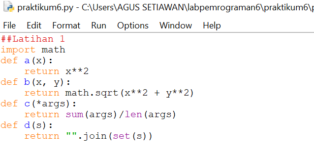
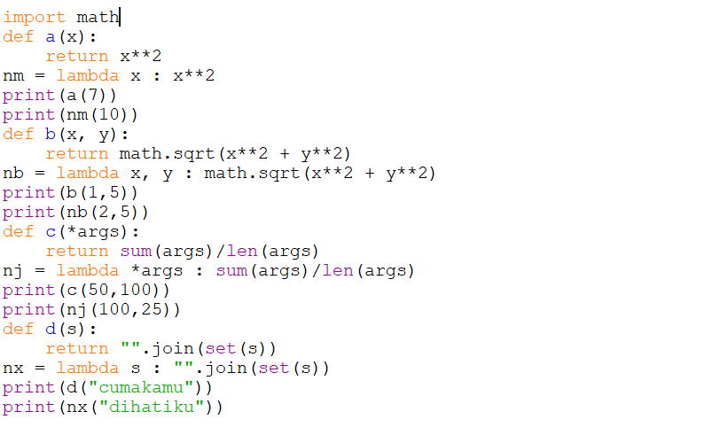
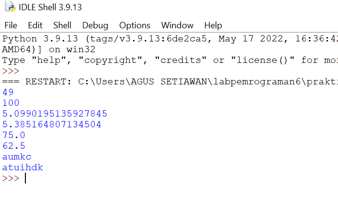
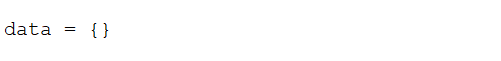
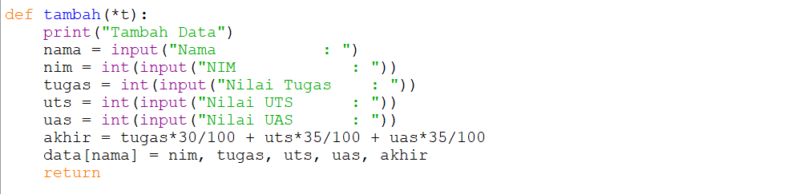
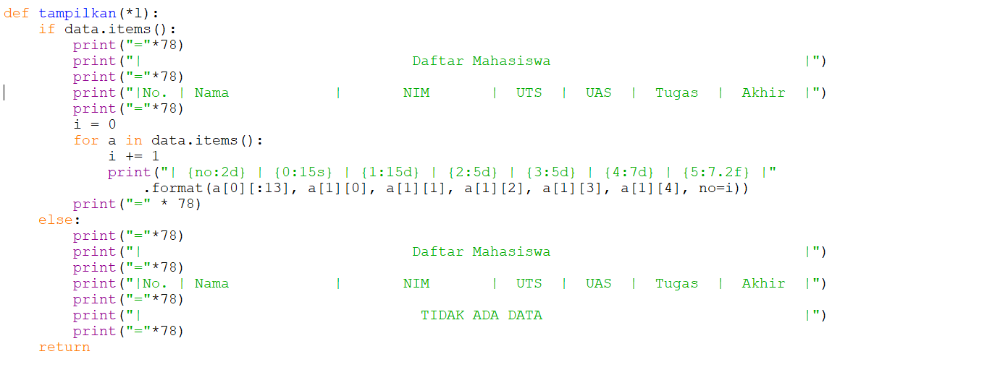
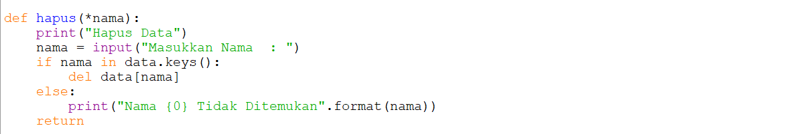
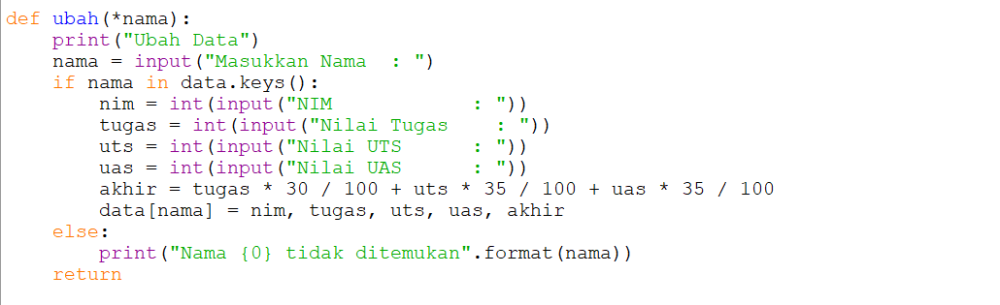

# PRAKTIKUM 6
## Latihan 1
#### Ubahlah kode di bawah ini menjadi fungsi menggunakan lambda.

#### dan dibuatlah program lambda seperti di bwah ini:

#### - output

## Tugas Praktikum
#### Buatlah program sederhana dengan mengaplikasikan pengguna fungsi yang akan menampilkan daftar nilai mahasiswa, dengan ketentuan:
- fungsi **tambah()** untuk menambahkan data
- fungsi **tampilkan()** untuk menampilkan data
- fungsi **hapus(nama)** untuk menghapus data berdasrkan nama
- fungsi **ubah(nama)** untuk mengubah data berdasarkan nama
- buatlah flowcart dan penjelasan program pada README.md
- commit dan push ke github
- terimkasih.

## Daftar nilai mahasiswa menggunakan fungsi
#### Sebelum kit menggunakan fungsi, kita membuat sebuah dictionary kosong terlebih dahulu.

#### setelah dictionary di buat, kita akan menampilkan data mahasiswa dengan menggunakan fungsi. Seperti gambar program di bawah ini:

#### fungsi menambahkan data

#### fungsi menampilkan data

#### fungsi menghapus data

#### fungsi mengubah data berdasarkan nama

#### Jika kita sudah membuat program seperti di atas, maka kita akan tau hasilnya seperti foto di bawah ini

## Tampilan program saat dijalankan
